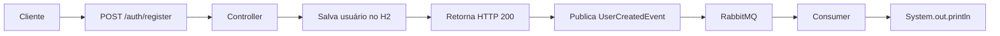

# Estudo RabbitMQ com Spring Boot

Projeto de estudos para aprender comunicação assíncrona utilizando **RabbitMQ** e **Spring Boot**. O sistema simula um cadastro de usuários onde, após o registro, um evento é publicado no RabbitMQ e consumido de forma assíncrona.

---

## Objetivo

Demonstrar na prática os conceitos fundamentais de mensageria assíncrona:

- **Comunicação assíncrona** — ação desacoplada entre producer e consumer
- **Producer** — publica eventos no RabbitMQ após uma ação (cadastro de usuário)
- **Consumer** — escuta a fila e processa o evento de forma desacoplada
- **Exchange** — do tipo **Direct**, encaminha a mensagem para a fila correta com base na routing key
- **Queue** — fila durável onde as mensagens são armazenadas até o consumo
- **Routing Key** — chave de roteamento que liga a exchange à fila
- **Publicação de eventos** — envio de objetos serializados (JSON) via `RabbitTemplate`
- **Consumo de eventos** — recebimento e processamento via `@RabbitListener`

---

## Fluxo da aplicação



### Etapas detalhadas

1. O cliente envia uma requisição `POST /auth/register` com `name`, `email` e `password` no corpo.
2. O `controller` recebe os dados e cria uma entidade `user`.
3. O usuário é persistido no banco H2 em memória via `entityRepository`.
4. A resposta `HTTP 200` é retornada ao cliente com os dados do usuário.
5. Um `UserCreatedEvent` (contendo nome e email) é publicado no RabbitMQ.
6. O `RabbitProducer` envia o evento para a exchange `user.exchange` com routing key `user.created`.
7. O RabbitMQ roteia a mensagem para a fila `user.created.queue`.
8. O `RabbitConsumer`, anotado com `@RabbitListener`, consome a mensagem.
9. Os dados do novo usuário são exibidos no console do consumer.

---

## Estrutura do projeto

```
src
 ├── main
 │    ├── java/com/clinly/estudorabbit
 │    │    ├── EstudoRabbitApplication.java
 │    │    ├── controller/
 │    │    │    └── controller.java
 │    │    ├── entity/
 │    │    │    └── user.java
 │    │    ├── repository/
 │    │    │    └── entityRepository.java
 │    │    └── rabbit/
 │    │         ├── config/
 │    │         │    └── RabbitConfig.java
 │    │         ├── producer/
 │    │         │    └── RabbitProducer.java
 │    │         ├── consumer/
 │    │         │    └── RabbitConsumer.java
 │    │         └── events/
 │    │              └── UserCreatedEvent.java
 │    └── resources/
 │         └── application.yaml
 └── test
      └── java/com/clinly/estudorabbit
           └── EstudoRabbitApplicationTests.java
```

---

## Tecnologias

| Tecnologia | Versão |
|---|---|
| Java | 21 |
| Spring Boot | 4.1.0 |
| Spring AMQP | via `spring-boot-starter-amqp` |
| Spring Data JPA | via `spring-boot-starter-data-jpa` |
| H2 Database | via `com.h2database:h2` |
| Jackson | via `jackson-databind` |
| Maven | via Wrapper |

---

## Como executar

### Pré-requisitos

- Java 21+
- RabbitMQ rodando em `localhost:5672` (usuário/senha padrão: `guest`)

### Passos

```bash
# 1. Clone o repositório
git clone https://github.com/lkznx7/estudoRabbit.git

# 2. Entre no diretório
cd EstudoRabbit

# 3. Suba o RabbitMQ (via Docker, por exemplo)
docker run -d --name rabbitmq -p 5672:5672 -p 15672:15672 rabbitmq:3-management

# 4. Acesse o RabbitMQ Management em http://localhost:15672 (guest/guest)

# 5. Execute a aplicação
./mvnw spring-boot:run
```

> **Nota:** O banco H2 é configurado em memória, não é necessário configuração adicional.

---

## Exemplo de requisição

```http
POST http://localhost:8080/auth/register
Content-Type: application/json

{
  "name": "João",
  "email": "joao@email.com",
  "password": "123456"
}
```

---

## Resultado esperado

1. O usuário é salvo no banco H2 em memória.
2. Um evento `UserCreatedEvent` é publicado na exchange `user.exchange`.
3. O RabbitMQ recebe a mensagem e a direciona para a fila `user.created.queue`.
4. O Consumer consome o evento da fila.
5. A seguinte mensagem é exibida no console do consumer:

```
--------------------------------
Novo usuário cadastrado!
Nome: João
Email: joao@email.com
--------------------------------
```

---

## Conceitos estudados

### RabbitMQ
Sistema de mensageria open source que implementa o protocolo AMQP. Permite comunicação assíncrona entre componentes do sistema de forma desacoplada.

### Queue
Fila de mensagens onde os eventos são armazenados até serem consumidos. Neste projeto, a fila `user.created.queue` é configurada como durável (`durable = true`).

### Exchange
Ponto central que recebe mensagens do producer e as roteia para as filas com base em regras de binding. Neste projeto é utilizada uma **Direct Exchange** (`user.exchange`).

### Routing Key
Chave utilizada pelo exchange para determinar qual fila receberá a mensagem. Neste caso: `user.created`.

### Producer
Componente responsável por enviar mensagens para o RabbitMQ. Implementado em `RabbitProducer.java` usando `RabbitTemplate.convertAndSend()`.

### Consumer
Componente que escuta e processa mensagens de uma fila. Implementado em `RabbitConsumer.java` usando a anotação `@RabbitListener`.

### Event-Driven Architecture (EDA)
Padrão arquitetural onde o fluxo do programa é determinado por eventos. O producer não conhece o consumer — o desacoplamento é garantido pelo broker de mensagens.

---

## Próximos passos

- [ ] Implementar **Dead Letter Queue (DLQ)** para tratar mensagens com falha
- [ ] Adicionar mecanismo de **Retry** com backoff exponencial
- [ ] Criar **múltiplos Consumers** para processamento paralelo
- [ ] Utilizar **Topic Exchange** para roteamento baseado em padrões
- [ ] Utilizar **Fanout Exchange** para broadcast de mensagens
- [ ] Implementar comunicação entre **microserviços**
- [ ] Adicionar envio de **e-mail** como ação reativa ao evento
- [ ] Implementar **auditoria** de eventos
- [ ] Criar **testes automatizados** (unitários e de integração)

---

## Licença

Este projeto está sob a licença MIT. Veja o arquivo [LICENSE](LICENSE) para mais detalhes.
