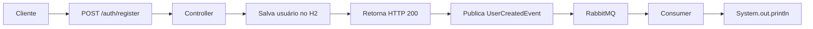

# Estudo RabbitMQ com Spring Boot

Projeto de estudos para aprender comunicação assíncrona utilizando RabbitMQ e Spring Boot. O sistema simula um cadastro de usuários onde, após o registro, um evento é publicado no RabbitMQ e consumido de forma assíncrona.

---

## Objetivo

Demonstrar na prática os conceitos fundamentais de mensageria assíncrona:

- **Producer** — publica eventos no RabbitMQ após uma ação (cadastro de usuário)
- **Consumer** — escuta a fila e processa o evento de forma desacoplada
- **Exchange** — do tipo **Direct**, encaminha a mensagem para a fila correta com base na routing key
- **Queue** — fila durável onde as mensagens são armazenadas até o consumo
- **Routing Key** — chave de roteamento que liga a exchange à fila
- **Publicação de eventos** — envio de objetos serializados (JSON) via `RabbitTemplate`
- **Consumo de eventos** — recebimento e processamento via `@RabbitListener`

---

## Fluxo da aplicação



### Etapas detalhadas

1. O cliente envia uma requisição `POST /auth/register` com `name`, `email` e `password` no corpo.
2. O `controller` recebe os dados e cria uma entidade `user`.
3. O usuário é persistido no banco H2 em memória via `entityRepository`.
4. A resposta `HTTP 200` é retornada ao cliente com os dados do usuário.
5. Um `UserCreatedEvent` (contendo nome e email) é publicado no RabbitMQ.
6. O `RabbitProducer` envia o evento para a exchange `user.exchange` com routing key `user.created`.
7. O RabbitMQ roteia a mensagem para a fila `user.created.queue`.
8. O `RabbitConsumer`, anotado com `@RabbitListener`, consome a mensagem.
9. Os dados do novo usuário são exibidos no console do consumer.

---

## Estrutura do projeto

```
com.clinly.estudorabbit
├── EstudoRabbitApplication.java          # Classe principal Spring Boot
├── controller/
│   └── controller.java                   # Endpoint REST /auth/register
├── entity/
│   └── user.java                         # Entidade JPA (UUID, name, email, password)
├── repository/
│   └── entityRepository.java             # JPA Repository
└── rabbit/
    ├── config/
    │   └── RabbitConfig.java             # Configuração da Exchange, Queue, Binding e JSON converter
    ├── producer/
    │   └── RabbitProducer.java           # Publica eventos no RabbitMQ
    ├── consumer/
    │   └── RabbitConsumer.java           # Consome eventos da fila
    └── events/
        └── UserCreatedEvent.java         # Record do evento (nome, email)
```

---

## Tecnologias

| Tecnologia | Versão |
|---|---|
| Java | 21 |
| Spring Boot | 4.1.0 |
| Spring AMQP | — |
| Spring Data JPA | — |
| H2 Database | — |
| Jackson | — |
| Maven | — |

---

## Como executar

### Pré-requisitos

- Java 21+
- Maven
- RabbitMQ rodando em `localhost:5672` (usuário/senha: `guest`)

### Passos

```bash
# Clone o repositório
git clone https://github.com/lkznx7/estudoRabbit.git

# Entre no diretório
cd EstudoRabbit

# Execute a aplicação
./mvnw spring-boot:run
```

### Testar o endpoint

```bash
curl -X POST http://localhost:8080/auth/register \
  -H "Content-Type: application/json" \
  -d '{"name": "João", "email": "joao@email.com", "password": "123456"}'
```

No console do consumer será exibido:

```
--------------------------------
Novo usuário cadastrado!
Nome: João
Email: joao@email.com
--------------------------------
```

---

## Configuração do RabbitMQ

Arquivo `application.yaml`:

```yaml
spring:
  application:
    name: EstudoRabbit
  rabbitmq:
    host: localhost
    port: 5672
    username: guest
    password: guest
```

### Componentes declarados em `RabbitConfig`

| Componente | Nome |
|---|---|
| Exchange | `user.exchange` (Direct) |
| Queue | `user.created.queue` (durável) |
| Routing Key | `user.created` |
| Message Converter | `JacksonJsonMessageConverter` |

---